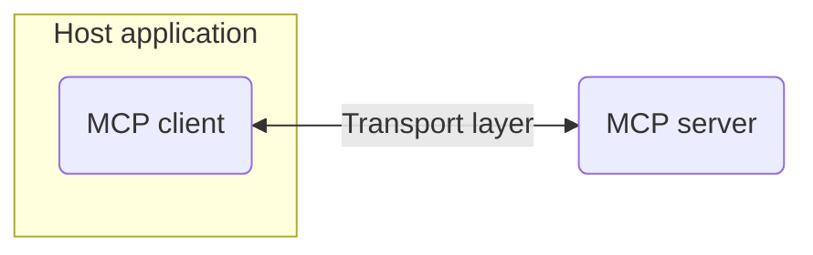
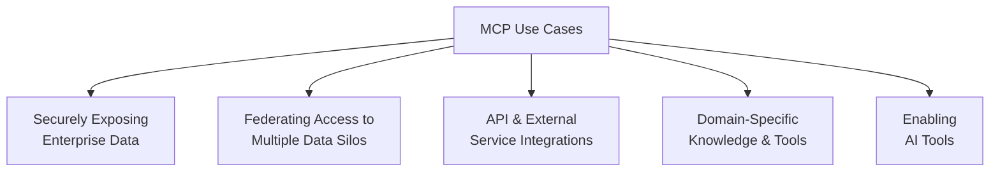

## Introduction

Large language models have transformed the way people interact with technology, yet these powerful models often operate in isolation from real-world data.
This isolation forces developers and users into a tedious cycle of copying data into chat windows, waiting for a response, and then applying the result manually.
On a larger scale, organizations face the NxM problem: dozens of AI models (N) must integrate with countless tools (M), leading to thousands of bespoke connectors.
The Model Context Protocol (MCP) was designed to break this cycle.
MCP provides a standard way for AI agents to access external data, tools and memory, making integrations plug-and-play rather than bespoke.

At the heart of this ecosystem sits the MCP server.
By exposing resources, tools and prompts, an MCP server delivers context directly to the model when it needs it.
With adoption accelerating since Anthropic open-sourced the standard in late 2024 and a rapidly growing community of servers and clients, understanding MCP servers has become essential for developers, businesses and AI enthusiasts alike.

This guide introduces the Model Context Protocol and MCP servers, explains why you might want to build or use one, describes how they work, outlines use cases across industries, provides practical steps to get started and answers common questions.
It concludes with security best practices and internal resources to explore next.

## What is MCP and what is an MCP server?

Understanding MCP requires examining both the protocol itself and the servers that implement it.

### Defining the Model Context Protocol

The Model Context Protocol is an open standard that enables AI agents to integrate external tools and data sources in a safe, structured and stateful way.
MCP uses a client-server architecture: a host application (such as a desktop app or IDE) embeds an MCP client to manage connections, while a separate MCP server exposes capabilities.
Communication happens over standard channels (STDIO for local integrations or streamable HTTP for remote ones) using JSON-RPC 2.0 to ensure stateful interactions.

MCP was created to solve the fragmentation inherent in tool integrations.
Function calling—where a model invokes predetermined functions by name—works but remains vendor-specific and still requires model-specific schemas.
MCP standardizes this process by describing tools, resources and prompts in a unified way and exposing them to any compatible AI client.
Because it is open and extensible, any developer can implement an MCP server or client, making the ecosystem portable across models, tools and platforms.

### Defining an MCP server

An MCP server is a lightweight program that exposes specific capabilities (resources, tools or prompts) to AI agents through the MCP protocol.
Instead of each AI model needing to understand how to call an API and parse responses, the MCP server handles the details and returns structured results.
In effect, MCP servers act as adapters: they can fetch data from databases, call external APIs, manipulate files or provide reusable prompts.

The protocol supports three types of exposures:

- **Resources**: Structured data such as files, database queries or API responses. For example, a file-system server might let the model read documents from a specific directory.
- **Tools**: Actions that the AI agent can perform, such as creating a GitHub issue or running a SQL query.
- **Prompts**: Pre-written instructions or templates that guide the model in a particular task, such as formatting a report.

### A brief history and the growing ecosystem

MCP represents a fundamental shift in how AI systems connect to external data and tools.

Anthropic introduced MCP in late 2024 and quickly open-sourced it to accelerate adoption.
Since then, hundreds of community servers have appeared—from simple reference implementations to sophisticated connectors for enterprise platforms.

Major platforms have embraced the standard:

- **[Microsoft's Azure MCP Server](https://github.com/Azure/azure-mcp)** allows AI agents to interact with Azure resources using natural language commands
- **[GitHub MCP Server](https://github.com/github/github-mcp-server)** enables AI agents to manage GitHub repositories (e.g., reviewing code, opening pull requests, browsing issues) through MCP-standardized interactions.
- **[Notion MCP](https://github.com/makenotion/notion-mcp-server)** offers secure, hosted access to Notion workspaces, allowing AI agents to read, write, and organize content in a user's workspace via MCP calls.
- **[PayPal Remote MCP Server](https://www.paypal.ai/docs/tools/mcp-quickstart#remote-mcp-server)** (now supporting Anthropic's API as well as OpenAI's) empowers AI tools to engage in agentic commerce workflows—such as generating invoices or facilitating payments—through natural language interactions.
- **[Figma Dev Mode MCP Server](https://www.figma.com/blog/introducing-figmas-dev-mode-mcp-server/)** grants AI coding agents access to precise design data—like graph metrics and color values—instead of relying on image interpretation, enabling highly accurate design-to-code experiences.

## Why do you need an MCP server?

MCP servers address fundamental challenges in AI integration.

While the technology may seem esoteric, an MCP server can offer concrete advantages for both individuals and businesses.

- **Reduce manual friction**: Without MCP, developers and users must copy data between applications, manually trigger APIs and assemble context. An MCP server centralizes these tasks, allowing an AI agent to perform them directly. For example, instead of pasting file contents into a chat, the agent can fetch the file via a file-system server and summarize it for you.
- **Solve the NxM integration problem**: Each AI model (N) connecting to each tool (M) traditionally requires a custom integration. MCP standardizes the interface so that any model can work with any tool, reducing integration overhead for teams maintaining complex AI systems.
- **Enable agentic workflows**: Agents can plan and execute sequences of actions when they have access to the right tools. For instance, an agent could read code from a repository, apply refactoring functions, create a pull request and notify team members—all via MCP.

## MCP architecture and how servers work

The MCP ecosystem consists of four main components working together.

### Hosts, clients, servers and transport

#### MCP Architecture



1. **Host application**: The primary application that interacts with users. Examples include Claude Desktop, IDEs like Cursor or VS Code and custom chat platforms.
2. **MCP client**: A component inside the host that connects to MCP servers. It negotiates capabilities, manages sessions and translates between the host's needs and the MCP protocol.
3. **Transport layer**: Communication can occur via STDIO for local servers (ideal when both client and server run on the same machine) or via streamable HTTP for remote servers.
4. **MCP server**: A standalone program that exposes resources, tools and prompts. Each server focuses on a single integration, such as a Git server or a weather service.

All interactions use JSON-RPC 2.0 to send requests, results, errors and notifications.
This ensures consistent message formats across implementations.

### The MCP lifecycle

Understanding the request flow helps when building or debugging MCP servers.

From the AI agent's perspective, using an MCP server follows a predictable pattern:

1. **Client request**: The user asks the host application to perform an action. The client packages the request and includes session or user identifiers.
2. **Capability discovery**: When the client connects to a server, it asks "What capabilities do you offer?". The server returns its available resources, tools and prompts. This step happens at least once per session, though the protocol does have support for servers updating capabilities dynamically.
3. **Permission prompt**: To protect privacy, the client may ask the user to approve a specific tool invocation. For instance, Claude Desktop might prompt "Allow the weather server to fetch the forecast?"
4. **Server processing**: The server receives the request, handles authentication and authorization, queries back-end systems or executes commands, applies masking or transformation logic and prepares a structured response.
5. **Response and context update**: The client integrates the returned data into the model's context and continues the conversation or workflow. The agent may call multiple servers sequentially and compose the results.

### Local vs remote connections for MCP

Choosing between local and remote deployment affects security and accessibility.

MCP supports both local and remote connections.
Historically, most implementations were **local**, using the **stdio** transport to exchange messages via standard input and output.
This worked because early iterations of the MCP specification didn't account for authentication or authorization.
However, the ecosystem is rapidly moving toward **remote** MCP servers that communicate over streamable HTTP.
Remote transports allow an agent to access services on other machines or across the Internet and support secure, multi-user environments.
The substack "Crossing the MCP Adoption Chasm" notes that most early implementations were local but predicts that remote MCP servers will overtake local ones as authentication matures.
Local servers remain ideal for sensitive data or offline use, but streamable HTTP is becoming the de facto standard for hosted services and cross-platform access.
When designing a server, think carefully about these tradeoffs and select the appropriate transport mechanism for your specific use case.

| Aspect              | Local MCP Server                     | Remote MCP Server                   |
| ------------------- | ------------------------------------ | ----------------------------------- |
| **Location**        | Same machine as client               | Separate machine or cloud           |
| **Transport**       | STDIO (standard input/output)        | Streamable HTTP/HTTPS               |
| **Installation**    | Requires local software installation | No client-side installation needed  |
| **Security**        | Relies on local system security      | TLS encryption + authentication     |
| **Performance**     | Faster (no network latency)          | Network latency overhead            |
| **Accessibility**   | Single user/machine only             | Multi-user, cross-platform access   |
| **Use Cases**       | File system access, hardware control | Team collaboration, cloud services  |
| **Compatibility**   | Desktop clients only                 | Web apps (ChatGPT), mobile, desktop |
| **Scalability**     | Limited to local resources           | Can scale with cloud infrastructure |
| **Maintenance**     | User manages updates                 | Centralized updates and management  |
| **User Experience** | Manual token/config setup            | Seamless OAuth 2.0 authentication   |

### Traditional APIs vs Function Calls vs MCP

MCP provides unique advantages over existing integration methods.

MCP differs from traditional RESTful APIs in its purpose and interaction model.
Whereas APIs are general interfaces that any software can call, MCP servers are designed specifically for AI agents and emphasize context, tool discovery and stateful interactions.
Traditional APIs require the model to understand the endpoint, parse the response and integrate the data.
With MCP, the server handles the API call and returns structured data, freeing the agent from parsing.

Function calling in modern AI models similarly allows the model to call external functions but still requires model-specific schemas and separate implementations for each model.
MCP builds on function calling by standardizing how tools are defined and discovered, providing a universal protocol that works across models and clients.

| Aspect                                        | Traditional APIs                                                                                                      | Function Calling (in LLMs)                                                                                                                                             | MCP (Model Context Protocol)                                                                                                                                                              |
| --------------------------------------------- | --------------------------------------------------------------------------------------------------------------------- | ---------------------------------------------------------------------------------------------------------------------------------------------------------------------- | ----------------------------------------------------------------------------------------------------------------------------------------------------------------------------------------- |
| **Purpose**                                   | Expose functionality/data to client applications; general software integration.                                       | Let LLMs invoke specific “tools/functions” via structured schemas to perform tasks (call APIs, compute things, etc.).                                                  | Provide a standard protocol so LLMs/agents can access external tools, data sources, and context in a uniform, model-agnostic way.                                                         |
| **Target Audience**                           | Software developers building apps or services.                                                                        | Developers building LLM-powered agents or applications, and the LLM itself.                                                                                            | Both developers and any AI model / agent frameworks that want to support interoperable tool & data access.                                                                                |
| **Schema / Contract Definition**              | Defined by each API (e.g. REST, GraphQL, gRPC). Can vary widely; must be documented.                                  | Defined tool/function schemas (often using JSON Schema or similar), provided to the LLM so it “knows” what it can call.                                                | MCP defines schemas for tools, resources, prompts, etc., in a standardized way (JSON-RPC transport, formal spec, SDKs).                                                                   |
| **Tool / Capability Discovery**               | Usually via external documentation; developer must integrate manually; each API is different.                         | The LLM is given the list of callable tools/functions in the prompt / config. Discovery is static per session/config.                                                  | Dynamic discovery: MCP clients can discover MCP servers’ capabilities (tools/resources) more flexibly.                                                                                    |
| **Implementation**                            | Applications make API calls (HTTP, RPC) using client libraries; developer handles schemas, endpoints, authentication. | Application supplies function definitions/schema; LLM returns a function call request; application executes and returns result to LLM.                                 | MCP uses a protocol (client-server), structured over JSON-RPC 2.0, with SDKs and MCP servers/clients; supports both local and remote servers.                                             |
| **Response Handling**                         | Application parses API responses (often arbitrary JSON / XML / etc.), handles errors, formats.                        | After LLM signals a function call, application executes the function and returns structured results; LLM may then incorporate that into its next prompt / response.    | MCP server returns structured data/resources; the protocol ensures consistent format; the client (agent/model) can use the results, maintain context etc.                                 |
| **Context Management / Stateful Interaction** | Typically stateless or limited state (sessions, tokens, cookies) built by developer.                                  | LLM maintains conversational context; function call results are often fed back into context in subsequent turns. State beyond that must be managed by the application. | MCP is designed to support richer and built-in context: metadata tagging, resources, tools, memory / stateful resources, and ability to orchestrate across multiple tools & data sources. |
| **Standardization**                           | Varies widely; many styles, conventions, auth mechanisms.                                                             | Emerging conventions (many use JSON Schema; many LLMs follow similar function-calling conventions), but still vendor-specific differences.                             | MCP is an open standard; aims at vendor-agnostic interoperability; uses JSON-RPC etc.                                                                                                     |
| **Integration / Development Effort**          | High when integrating many APIs: each API needs its own client, schema handling, error handling, auth, etc.           | Lower: define the function schemas once, then LLM uses them; still need to implement the actual function/tool endpoints and error handling.                            | Lower (relative) once MCP is supported: plug into existing MCP servers or build servers for your tools; clients/agents understand them; less custom glue code.                            |
| **Error Handling & Security**                 | Each API defines its own errors; security/auth handled per API; responsibility on developer.                          | Function schema constrains parameter types; still need application-level error handling; potential security issues if tools/functions do harmful things.               | MCP includes standardized error formats (JSON-RPC), permissioning, and audit concepts; still evolving and security risks are being researched.                                            |

## Use cases and examples

MCP servers enable diverse applications across industries.



### Securely exposing enterprise data

Enterprises need controlled access to sensitive systems.

Enterprises often store sensitive customer or operational data in CRM, ERP or HCM systems.
Connecting these directly to an AI agent can be risky and requires significant integration work.
An MCP server can sit between the agent and these systems, enforcing authentication, authorization and data masking.
For instance, a finance MCP server might fetch transaction records but mask account numbers before returning them.

### Federating access to multiple data silos

Organizations often struggle with fragmented data sources.

Many organizations have data scattered across databases, file systems and SaaS tools.
An MCP server can act as a semantic data layer, orchestrating queries across multiple systems and returning unified results.
This allows agents to answer questions that span multiple sources without custom code.

### API and external service integrations

Public APIs become accessible through natural language.

MCP servers can wrap public APIs—weather services, stock quotes, geocoding or social media platforms—so that agents can call them with simple commands.
For example, a web scraping server can search the web and extract current data, while a database server can run SQL queries.

### Domain-specific knowledge and tools

Industry expertise can be packaged into specialized servers.

Industry-specific MCP servers can provide curated data sets (medical codes, legal precedents, product catalogs) or expose tools like CRM updates and HR workflows.
A healthcare MCP server, for instance, might allow an agent to look up symptom-disease relationships or schedule appointments.

### Enabling AI tools

Agents can take actions on behalf of users.

Some MCP servers expose actual tools or actions.
For example, a GitHub server may let an agent create an issue, review a pull request or clone a repository, while a DevOps server can manage Kubernetes resources.
These actions empower agents to act on behalf of the user.

## Limitations and challenges of MCP adoption

Despite rapid growth, MCP faces several adoption hurdles.

Understanding these challenges will help you set realistic expectations and plan mitigation strategies.

- **Limited tool scope and few enterprise servers**: Because early versions of the spec lacked authentication and authorization, most existing servers run locally via stdio and expose a narrow set of tools. Remote servers require secure authentication; as a result, there are still relatively few enterprise-grade MCP servers covering complex business systems. Many companies must build their own connectors, and the ecosystem of off-the-shelf servers is still nascent.

- **Spec maturity and ecosystem size**: Authorization and remote transport were only added to the official spec in March 2025, and the proposals continue to evolve. The protocol and its tooling are still early; features like OAuth support, protected resource metadata and multi-user client management are under active development. This immaturity means that integration patterns may change and enterprises may hesitate to rely on MCP for critical workflows.

- **Security remains paramount**: Early MCP servers lacked built-in security controls and often operated under the assumption that the local environment could be trusted. Without proper authentication, authorization and data masking, an agent could inadvertently expose sensitive files or perform unauthorized actions.

These limitations are typical of an emerging standard.
As the ecosystem matures—with better tooling, more hosted servers and stronger security models—many of these challenges will lessen.
For now, awareness of the shortcomings helps you plan and prioritize accordingly.

## How to build and connect to an MCP server

Creating your first MCP server is straightforward with the right tools.

Building an MCP server is easier than you might think, especially with official SDKs, community libraries and detailed examples.
After deciding on which resources, tools and prompts you want your server to expose, choose an SDK in a programming language of your choice.
Here are some examples of well-known SDKs for different programming languages:

- **Python**: [modelcontextprotocol/python-sdk](https://github.com/modelcontextprotocol/python-sdk), [jlowin/fastmcp](https://github.com/jlowin/fastmcp)
- **JavaScript**: [modelcontextprotocol/typescript-sdk](https://github.com/modelcontextprotocol/typescript-sdk)
- **Java**: [modelcontextprotocol/java-sdk](https://github.com/modelcontextprotocol/java-sdk)
- **Go**: [modelcontextprotocol/go-sdk](https://github.com/modelcontextprotocol/go-sdk), [mark3labs/mcp-go](https://github.com/mark3labs/mcp-go)

The specific steps for implementing a server are dependent on the language and SDK you choose, but generally involve the following steps:

1. Install the SDK using the language's package manager.
2. Create a new instance of the MCP server using the SDK.
3. Configure the server with the desired resources, tools and prompts.
4. Start the server using an appropriate transport mechanism.

While you develop your server, you'll want to verify that the exposed tools behave as expected.
The **MCP inspector** is a visual testing tool that makes this process simple.
Run it locally with

```shell
npx @modelcontextprotocol/inspector@latest
```

Then enter the URL of your remote or local MCP server and authenticate if necessary.
After logging in, click **List Tools** to see and interact with the server's tools.
This browser-based interface lets you invoke methods, inspect responses and debug your server without wiring up a full client.

Beyond the official **MCP inspector**, there is a [specialized fork by MCP Jam](https://github.com/MCPJam/inspector).
It includes powerful enhancements such as multi-server support, an LLM playground, and improved logging and developer experience.

## Security and best practices

Security must be a primary consideration when deploying MCP servers.

While MCP streamlines integrations, it does not include built-in authentication, authorization or encryption by default.
This flexibility allows implementations to choose their own security model, but it also introduces risk.
While most existing security best practices also apply to MCP, it also introduces new challenges and attack vectors such as prompt injection.
Prompt injection is a type of attack where an LLM is tricked into following malicious instructions that go beyond the scope of the prompt originally written by the user.
Implementing proper access control, and audit logging is therefore all the more important for securely using MCP servers in production.

### Implement authentication and authorization

Adding secure authentication and authorization remains one of the biggest hurdles for MCP adoption.
Authentication verifies the identity of the client or user, while authorization restricts what actions the agent can perform.
The **Hypr MCP Gateway** solves much of this complexity by acting as an OAuth proxy with dynamic client registration and prompt telemetry.
By separating authentication into a gateway, your MCP server can remain lightweight and spec-compliant without you writing your own auth code.
On the other hand, always require the user to approve tool usage, when implementing an MCP client or AI agent, especially when dealing with sensitive operations or data.

### Encrypt communication

As any service exposed via the internet, remote MCP servers should be encrypted using TLS (HTTPS).
Unencrypted communication can be intercepted and tampered with by a malicious actor opening up a wide range of attack vectors.
Local servers can rely on STDIO, which does not require or support encryption.

### Restrict permissions

Research by Knostic and Backslash Security found that many MCP servers in 2025 lacked any form of authentication and were over-permissioned.
By following the principle of least privilege, thus only exposing the minimum capabilities required, you can reduce the attack surface and minimize the impact of successful attacks such as prompt injection.
Configure fine-grained scopes and avoid giving the agent write access when read-only is sufficient.

### Limit file access

The local file system is one of the most sensitive resources available to an agent and requires very careful protection.
Only grant MCP servers access to the file system when it is necessary.
Never grant access to files outside of the intended directory, or worse, the entire file system.

MCP provides a mechanism for clients to inform servers about available file system boundaries they can operate within called “Roots”.
Descope recommends defining roots, as these file system boundaries prevent accidental exposure of sensitive files.
This helps to prevent data leaks.
For example, you can restrict a server to `/user/documents/project/` rather than the entire drive.

### Monitor and audit

Visibility enables security and compliance.

Log all requests and responses for auditing.
Implement rate limiting to prevent denial-of-service attacks.
Periodically review the server's permissions, update dependencies, and apply security patches.

## MCP Logo

The official MCP logos are available for use in your projects and documentation.

| Logo                                                                                                                                                     | Description                  | Download                                |
| -------------------------------------------------------------------------------------------------------------------------------------------------------- | ---------------------------- | --------------------------------------- |
|               | MCP Icon (PNG)               | [Download PNG](/mcp/mcp-logo-icon.png)  |
|  | MCP Logo Black Version (SVG) | [Download SVG](/mcp/mcp-logo-black.svg) |
|  | MCP Logo White Version (SVG) | [Download SVG](/mcp/mcp-logo-white.svg) |

## Frequently asked questions

### What is a remote MCP server and how does it differ from a local one?

The deployment model affects accessibility and security.

A remote MCP server runs on a separate machine and communicates over streamable HTTP, often secured by TLS and authentication.
It's ideal for sharing capabilities across a team or exposing cloud services.
Using a remote MCP server does not require installation of any additional software, which makes it possible to use it with web-based applications such as ChatGPT.
A local MCP server operates on the same machine as the client and uses STDIO, which is generally faster and simpler to implement.
Running on local hardware enables some unique use-cases by allowing access to the file-system and other hardware.

### Why do I need an MCP server if I already use function calling or APIs?

MCP provides standardization beyond existing approaches.

Function calling and APIs handle discrete tasks but lack a universal discovery mechanism and often require per-model schemas.
MCP standardizes how tools are defined, discovered and called across models and clients.
It eliminates repetitive boilerplate and integrates context management, making it easier to build complex agentic workflows.

### How do I connect my agent to an MCP server?

Configuration varies by client implementation.

Most MCP clients provide a configuration interface.
In tools like Claude Desktop, you specify the server's address and port (or choose a local one) and enable the client.
During startup, the client discovers available tools, making them available for use through natural language commands.
Individual tool calls typically require user approval.

### How is MCP different from JSON-RPC?

MCP builds on JSON-RPC with specific semantics.

MCP uses JSON-RPC 2.0 as its underlying message format.
JSON-RPC defines how messages are structured (method, parameters, result, error) while MCP defines which methods are available, how to describe them and how to manage context and permissions.

### Can I expose multiple services through one MCP server?

Server architecture affects maintainability and security.

While a single server could theoretically expose multiple unrelated services, the recommended pattern is to create one server per domain (e.g., a Git server, a weather server).
This keeps implementations simple and avoids permission creep.
However, you can orchestrate multiple servers from a host or through a meta-server that aggregates their capabilities.

### Are there any limitations to using MCP servers?

The ecosystem is still evolving.

Many servers and clients are in beta, and the specification continues to evolve.
You may encounter inconsistent implementations or limited support for complex data types.
Always consult the latest documentation and be prepared to update your servers when the protocol changes.

### How do I troubleshoot when a tool isn't working?

Systematic debugging helps identify issues quickly.

Ensure the client can connect to the server (check network connectivity and firewall rules).
Verify that the tool appears in the list of capabilities and that you've approved it.
Check server logs for errors and confirm that authentication tokens are valid.
If the server returns errors, ensure you're passing the correct parameters and that the back-end system is reachable.

### How does Authentication for Remote MCP servers work?

Authentication can work by manually passing a token (often a JWT) via a header.
As an alternative, MCP servers can support OAuth 2.0 for an interactive and user-friendly authentication flow.

For this to work, remote MCP servers need to implement three key components:

- **Dynamic Client Registration (DCR)** - Clients register automatically without manual configuration
- **Authorization Server Metadata (ASM)** - Servers expose their OAuth endpoints through well-known URLs
- **Cross-Origin Resource Sharing (CORS)** - Enables secure browser-based authentication flows

You can find another blog post on building an authentication layer for MCP servers at
[Building Supabase-like OAuth Authentication For MCP Servers](/blog/mcp-server-authentication).

## Conclusion

MCP represents a fundamental shift in AI integration.

The Model Context Protocol and MCP servers mark a significant step forward in connecting AI agents to the real world.
By standardizing how models discover and call tools, MCP reduces integration complexity, unlocks powerful agentic workflows and enables secure access to proprietary data.
Whether you're a developer automating repetitive tasks, a business integrating AI into legacy systems or a researcher exploring agentic AI, building or using an MCP server can save time and deliver richer interactions.

If you need support building an enterprise-grade MCP server, [contact us](https://hyprmcp.com/waitlist/) or check out our [Open Source MCP Gateway](https://github.com/hyprmcp/mcp-gateway)
