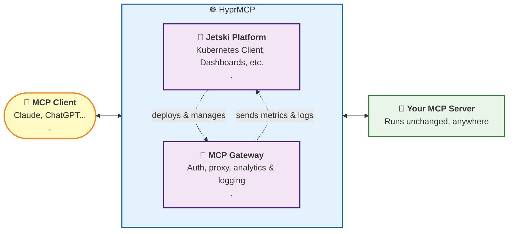

HyprMCP is an Open Source MCP Analytics and Authentication Platform.
It solves the three biggest problems teams face when developing MCP servers with zero code changes:

1. **Installation & Setup**: Most users never make it past setup. They can't find client instructions or try to open your MCP URL in a browser and churn immediately.
2. **Authentication**: Identifying users and giving them the right tools and responses is still painful to implement.
3. **Logs, Analytics & Visibility**: No insight into how your MCP is used, which prompts trigger which tools, or why errors happen.

The platform manages and deploys instances of the MCP Gateway that sits in front of your MCP server and handles the complexity.
It also collects and aggregates all analytics and metrics data captured by the gateway.
You keep your existing server unchanged, and we handle authentication, generate user-friendly setup instructions, and provide comprehensive analytics and logging.

## Architecture

## How It Works

1. **MCP Client** (Claude Desktop, Cline, etc.) sends requests to HyprMCP instead of directly to your server
2. **HyprMCP Gateway** authenticates the user and validates permissions
3. **Request forwarding** to your unchanged MCP server
4. **Response handling** with automatic logging, analytics capture, and monitoring
5. **Real-time dashboard** provides visibility into all operations

## Features

**Comprehensive Prompt Analytics** - See which prompts triggered which tools, from which clients, and what happened.
Gain complete visibility into your MCP server usage patterns and understand how users interact with your tools in real-time.

**Auto-Generated Setup Instructions** - Help users connect to the client effortlessly.
We automatically generate clear, step-by-step instructions for every supported MCP client, eliminating the number one reason users churn during onboarding.

**Zero-Code Authentication** - Identify and manage users securely without writing a single line of code.
Our gateway handles all authentication logic, allowing you to provide personalized tools and responses based on user identity.

**Real-Time Debug Logs** - Instantly debug issues and understand server behavior in real-time.
See detailed logs of every request, response, and error, making it easy to identify and fix problems quickly.

## HyprMCP Components

The HyprMCP platform is built on several open-source components that work together to provide a comprehensive MCP management solution:

| Component                          | Description                                                                                                        |
| ---------------------------------- | ------------------------------------------------------------------------------------------------------------------ |
| **Jetski Platform**                | Kubernetes client, dashboards, and orchestration. Manages and deploys MCP Gateway instances.                       |
| **MCP Gateway**                    | OAuth proxy with dynamic client registration (DCR) and MCP prompt analytics. Sits in front of your MCP server.     |
| **Install Instructions Generator** | Generates MCP server installation instructions for Cursor, Visual Studio Code, Claude Code, and other MCP clients. |

## Getting Started

Create your free account at [app.hyprmcp.com](https://app.hyprmcp.com) to get started or check out our [self-hosting](/docs/self-hosting/) section.
