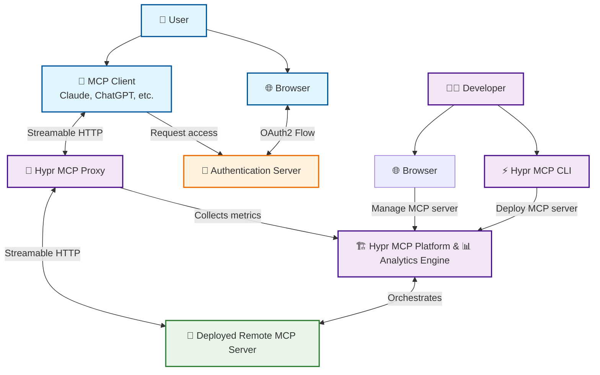

import {Aside} from '@astrojs/starlight/components';

Hypr MCP is an open-source, serverless hosting, authentication and analytics provider to deploy MCP servers with a single command.
Engineers use Hypr MCP to let their users easily use their MCP servers by browser-based MCP clients, like Claude, ChatGPT and improve the authorization experience by using the latest OAuth2 login standard for MCP servers out of the box.

Hypr MCP provides insights into the usage of your MCP server, like the number of clients, tool calls, and serverless hosting with a generous free tier - think of it as a Vercel for MCP servers.

## Architecture

## Hypr MCP in Short

| Feature                               | Description                                                                                                   |
| ------------------------------------- | ------------------------------------------------------------------------------------------------------------- |
| 🚀 **One-command deployment**         | Deploy MCP servers with a single command - no complex configuration required.                                 |
| 🔗 **Browser-based MCP clients**      | Seamlessly connect MCP servers to browser-based clients like Claude, ChatGPT, and other AI assistants.        |
| 🔒 **Built-in OAuth2 authentication** | Latest OAuth2 login standard for MCP servers out of the box, improving user authorization experience.         |
| 📊 **Rich analytics & insights**      | Track usage metrics including client connections, tool calls, and server performance with detailed analytics. |
| ⚡ **Serverless hosting**             | Serverless architecture with generous free tier - think Vercel for MCP servers.                               |
| 🎯 **Developer-focused**              | Built by engineers, for engineers - simple API and intuitive developer experience.                            |
| 📱 **Easy integration**               | Simple integration with existing MCP servers and development workflows.                                       |

## Who is Hypr MCP for?

Hypr MCP helps:

- **MCP server developers** who want to easily deploy and share their MCP servers with users
- **AI engineers** building MCP tools and integrations for AI assistants
- **Development teams** who need analytics and insights into their MCP server usage
- **Organizations** looking to provide seamless MCP server access to their users

## What can I do with Hypr MCP?

Hypr MCP enables you to:

- **Deploy MCP servers** with a single command to serverless infrastructure
- **Connect to AI clients** seamlessly through browser-based MCP clients like Claude and ChatGPT
- **Secure access** with built-in OAuth2 authentication and authorization
- **Monitor usage** with detailed analytics on client connections, tool calls, and server performance
- **Scale automatically** with serverless hosting that grows with your needs

## Where do I start?

<Aside type="caution">
  Hypr MCP is currently in early access. Join our [waitlist](/waitlist) to get
  priority access and be among the first to deploy MCP servers with ease.
</Aside>
